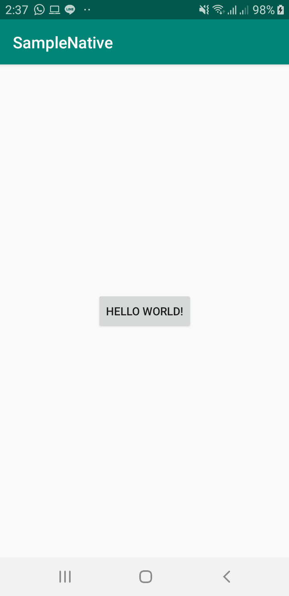
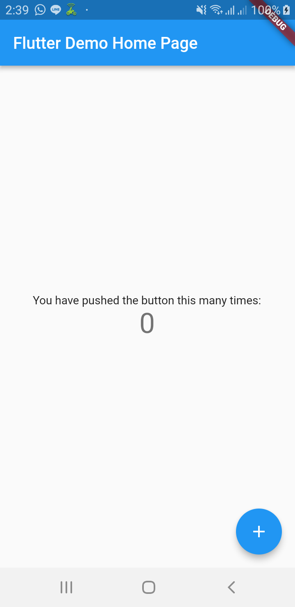
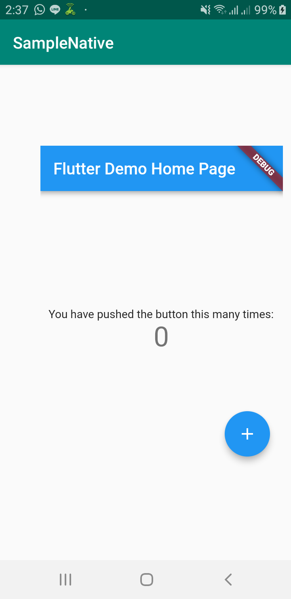

# Add 2 App

Aplikasi ini membahas tentang membuat sebuah modul Flutter yang akan di tampilkan pada aplikasi Native (Java or Kotlin).

### Screenshots Aplikasi Native

<pre>

</pre>

### Screenshots Modul Flutter

<pre>

</pre>

### Screenshots Aplikasi Native Dengan Memanggil Modul Flutter

<pre>

</pre>

## Author

* **R Rifa Fauzi Komara**

Jangan lupa untuk follow dan ★
